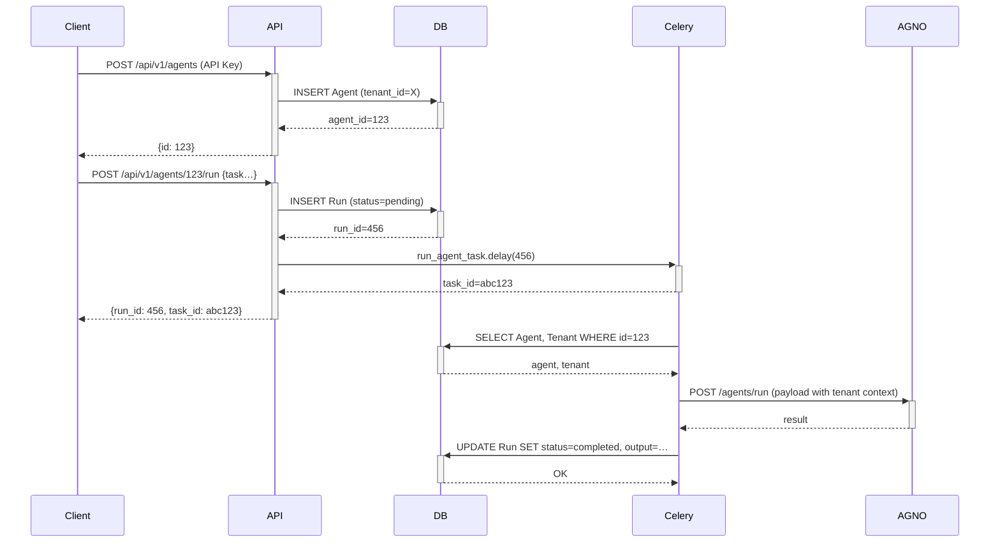

# AgentAichain Architecture

## Overview

AgentAichain is a **multi-tenant B2B platform** for orchestrating AI agents. Built on FastAPI, SQLAlchemy, and AGNO, it provides complete tenant isolation, audit logging, and GCP-native deployment.

The system consists of:
- **Backend**: FastAPI REST API with async SQLAlchemy, Celery, and AGNO integration
- **Frontend**: React + TypeScript SPA with Vite, Tailwind CSS, and React Query
- **Database**: PostgreSQL (metadata) + Redis (queues/cache)

---

## Core Principles

1. **Multi-tenancy by design** – Every query is scoped to a tenant_id, enforced at the database and application layers
2. **Stateless API layer** – Horizontal scaling in Cloud Run
3. **Async-first** – Async SQLAlchemy, async HTTP requests, Celery for long-running tasks
4. **Observability** – Structured JSON logs, audit trails, Prometheus metrics
5. **Security** – API-key auth, JWT for user auth, secrets management via GCP Secret Manager
6. **Separation of concerns** – Settings management decoupled from agent execution

---

## System Components

### 1. FastAPI Application (`agent_aichain/main.py`)

- REST API endpoints under `/api/v1/`
- CORS enabled for web frontends
- Global exception handler with structured logging
- Health check endpoint (`/health`)
- Router composition: auth, agents, teams, runs, api_keys, settings

### 2. SQLAlchemy Models (`agent_aichain/models/`)

**Tenant Isolation:**
- `Tenant` – Top-level tenant entity
- `User` – Belongs to a tenant (JWT auth)
- `APIKey` – Machine-to-machine auth, scoped to tenant
- `Agent` – AI agent definition (tenant-scoped)
- `Team` – Group of agents (tenant-scoped)
- `Run` – Execution record (tenant-scoped)
- `Skill` – Reusable agent capability (global catalog)
- `AIModel` – Provider-agnostic model configuration
- Association table `team_agents` for many-to-many Agent ↔ Team

All models have `tenant_id` foreign key (except global models like Skill, AIModel) and relationships enforce isolation.

### 3. Settings Management (`agent_aichain/api/settings.py`)

**New in Phase 2:**
- **Skills** (`/settings/skills`): CRUD for agent capabilities (search, calculator, etc.)
- **AI Models** (`/settings/models`): Provider-agnostic model definitions
  - Supports any provider: OpenAI, Anthropic, Google, Ollama, OpenRouter, custom
  - Fields: `name`, `provider`, `base_url`, `api_key`, `max_tokens`, `max_context`, `cost_per_1k_input/output`, `config` (JSON), `is_active`
  - Cost tracking for billing/analytics
  - Active/inactive status to control model availability

**Validation:**
- Agents must reference an existing active AIModel
- Backend validates on create/update (400 error if model not found or inactive)

### 4. Database Layer

**PostgreSQL (Cloud SQL):**
- Stores all metadata
- Async connection pool via `SQLAlchemy 2.0 async`
- Alembic for migrations (see `alembic/versions/`)
- Row-level security could be added if needed

**Redis (Memorystore):**
- Celery broker (queue 1)
- Celery result backend (queue 2)
- Optional cache layer for frequent queries

### 5. Agent & Team Execution

**TenantAwareAgent (`workers/agno_wrapper.py`):**
- Wraps AGNO Agent API
- Injects tenant context into payload
- Handles HTTP communication, timeouts, errors

**TenantAwareTeam:**
- Wraps AGNO Team API
- Serializes team composition (list of agents)
- Injects tenant metadata

**Celery Tasks (`workers/tasks.py`):**
- `run_agent_task` – Async execution via Celery
- `run_team_task` – Team execution via Celery
- Both use asyncio to run async DB operations
- Update `Run` status (pending → running → completed/failed)

### 6. Authentication & Authorization

**API Key Auth (primary for B2B):**
- Header: `X-API-Key: <key>`
- Hashed storage (bcrypt)
- Optional expiry
- Inactive revocation

**JWT Auth (for web UI):**
- OAuth2 password flow (`/auth/token`)
- Tokens contain `sub` (user_id) and `tenant_id`
- Signed with HS256
- Default expiry: 24 hours (configurable via `ACCESS_TOKEN_EXPIRE_MINUTES`)
- Distinct error messages: "Token expired" vs "Invalid token"

### 7. Security & Isolation

**Database-level:**
- All queries filter by `tenant_id` (see API layer)
- No cross-tenant queries allowed
- Foreign keys cascade delete tenant data

**Application-level:**
- `get_current_user` and `get_current_tenant` dependencies
- Model validation: agents must use active models
- Structured audit logging (JSON with tenant_id, user_id)

**Infrastructure-level:**
- GCP Secret Manager for secrets (not env vars in prod)
- Private VPC for Cloud SQL, Redis
- Cloud Run IAM restrictions

---

## Frontend Architecture (`frontend/`)

### Technology Stack

- **React 18** – Component library with hooks
- **TypeScript** – Strict type checking
- **Vite** – Fast HMR and builds
- **Tailwind CSS** – Utility-first styling
- **React Query** – Server state management, caching, auto-refresh
- **React Router v6** – Client-side routing
- **Axios-like client** – Custom `ApiClient` with interceptors

### Project Structure

```
frontend/
├── src/
│   ├── App.tsx              # Root component with routes
│   ├── main.tsx             # Entry point
│   ├── types/               # TypeScript interfaces
│   ├── lib/
│   │   ├── api/client.ts    # API client singleton
│   │   └── hooks/useApi.ts  # React Query hooks
│   ├── components/
│   │   ├── ui/              # Reusable UI components (Button, Card, Input, Modal, Select)
│   │   ├── layout/          # MainLayout, navigation
│   │   └── common/          # LoadingSpinner, StatusBadge
│   └── pages/
│       ├── auth/            # LoginPage, RegisterPage
│       ├── dashboard/       # DashboardPage
│       ├── agents/          # AgentsPage (CRUD + dynamic model dropdown)
│       ├── teams/           # TeamsPage
│       ├── runs/            # RunsPage
│       ├── api-keys/        # ApiKeysPage
│       └── settings/        # SkillsPage, ModelsPage
├── tailwind.config.js
├── vite.config.ts
└── package.json
```

### Data Flow

1. **Authentication**: Login → store JWT in localStorage → ApiClient attaches `Authorization: Bearer <token>`
2. **Data fetching**: React Query hooks (`useAgents`, `useModels`, etc.) with automatic refetching and caching
3. **Mutations**: `useCreateAgent`, `useUpdateAgent`, etc. invalidate relevant queries on success
4. **Real-time updates**: `useRun` hook polls every 2s while run is `pending` or `running`

### Key Features

- **Protected Routes**: `ProtectedRoute` wrapper redirects to login if unauthenticated
- **Dynamic Model Dropdown**: AgentsPage loads models from `/settings/models` and filters active ones
- **Model Status Indicators**: Inactive models shown with warning ⚠️
- **Agent Edit**: Pre-filled modal with existing data, supports partial updates
- **Error Handling**: API errors displayed inline, token expiration handled with clear messages

---

## Data Flow: Create & Run Agent



---

## Deployment Architecture (GCP)

```
┌─────────────────┐
│    Client /     │
│   Frontend      │  (served from Cloud Storage or separate Cloud Run)
└────────┬────────┘
         │ HTTPS + API Key
┌────────▼──────────────┐
│ Cloud Run (stateless) │
│   agent-aichain-api   │  (backend)
└────────┬──────────────┘
         │
    ┌────┴────┬─────────┬─────────┐
    ▼         ▼         ▼         ▼
┌─────┐  ┌─────────┐ ┌─────┐ ┌─────────┐
│SQL  │  │  Redis  │ │GCS  │ │ Secret  │
│ Cloud│ │Memory   │ │Artif│ │ Manager │
│Store │ │store    │ │acts │ │         │
└─────┘  └─────────┘ └─────┘ └─────────┘
```

- **Cloud Run**: Auto-scaling, pay-per-use, 0 to thousands of req/s
- **Cloud SQL**: PostgreSQL with automated backups
- **Memorystore**: Redis HA (optional standard tier)
- **GCS**: Agent artifacts, logs (optional)
- **Secret Manager**: DB passwords, JWT secrets, AGNO keys
- **Cloud Monitoring**: Metrics, dashboards, alerts
- **Cloud Logging**: Structured JSON logs exported

---

## Scalability Considerations

1. **Stateless API** – All state in DB/Redis; any Cloud Run instance can handle any request
2. **Database connection pooling** – PgBouncer could be added if needed; Cloud Run respects `DATABASE_URL` pool size
3. **Celery Workers** – Separate deployment (Cloud Run jobs or GKE) with auto-scaling based on queue depth
4. **Rate Limiting** – Per-tenant per-minute limits (to be implemented via Redis counters)
5. **Caching** – Redis cache for frequent tenant/agent lookups
6. **Database Read Replicas** – For heavy read workloads (future)
7. **Frontend CDN** – Static assets served via Cloud CDN for low latency

---

## Multi-Tenancy Implementation Details

**Models:**

Every table has `tenant_id` (foreign key to `tenants.id`). All SELECT queries include `WHERE tenant_id = :current_tenant`. On DELETE of tenant, cascade deletes all associated data.

**Global Models (Settings):**
- `Skill` and `AIModel` are **global** (no tenant_id) – shared across all tenants
- This allows centralized catalog of capabilities and model configurations
- Tenant isolation still enforced via agent → model reference validation

**Example query pattern (SQLAlchemy):**

```python
# Correct: tenant-scoped
query = select(Agent).where(
    Agent.tenant_id == current_tenant_id,
    Agent.is_active == True
)

# Wrong: unscoped (would leak cross-tenant data)
query = select(Agent).where(Agent.is_active == True)  # ❌ NEVER DO THIS
```

**API Endpoints (all require authentication):**

- Auth: `/api/v1/auth/token`, `/api/v1/auth/register-tenant`
- Agents: `/api/v1/agents/` (list, create), `/api/v1/agents/{id}` (get, delete), `PUT /api/v1/agents/{id}` (update)
- Teams: `/api/v1/teams/` (list, create), `/api/v1/teams/{id}` (get, add/remove agents)
- Runs: `/api/v1/runs/` (list), `/api/v1/runs/agent/{agent_id}` (create), `/api/v1/runs/team/{team_id}` (create)
- API Keys: `/api/v1/api-keys/` (list, create, revoke)
- Settings:
  - Skills: `/api/v1/settings/skills` (list, create, get, update, delete)
  - Models: `/api/v1/settings/models` (list, create, get, update, delete)

---

## Monitoring & Observability

**Structured Logging (JSON):**

```json
{
  "timestamp": "2026-04-03T12:34:56.789Z",
  "level": "info",
  "event": "agent_run_completed",
  "tenant_id": 42,
  "agent_id": 123,
  "tokens_used": 450,
  "duration_ms": 1234
}
```

**Prometheus Metrics (to be added):**

- `agent_runs_total` (by tenant, status)
- `agent_run_duration_seconds` (histogram)
- `api_requests_total` (by endpoint, method, status)
- `celery_tasks_active`
- `database_connections_active`

**Frontend Error Reporting:**
- Console errors logged with context
- React Error Boundaries planned for better UX

---

## Security Checklist

- [x] Secrets in GCP Secret Manager (not .env in prod)
- [x] API key hashing (bcrypt)
- [x] JWT signed with strong secret (HS256)
- [x] CORS restricted to known origins
- [x] All queries tenant-scoped
- [x] Model validation (agents must use active models)
- [x] Distinct JWT error messages (expired vs invalid)
- [ ] Rate limiting (Redis-based)
- [ ] IP allowlisting per tenant (future)
- [ ] Pen test penetration testing
- [x] Database encryption at rest (Cloud SQL default)
- [x] TLS 1.2+ enforced (Cloud Run default)

---

## Future Enhancements

- WebSocket streaming for real-time agent responses
- Neo4j integration for persistent agent memory
- Advanced billing (Stripe) with usage-based pricing per tenant
- SSO integration (SAML/OIDC)
- Multi-region failover
- Advanced RBAC (roles: admin, operator, viewer per tenant)
- Feature flags per tenant
- S3-compatible artifact storage (agent uploads, logs)
- Frontend: Chat interface for agent interaction (real-time run polling)
- Frontend: Team run execution with collaborative agents
- Frontend: Run detail page with streaming output

---

*Last updated: 2026-04-04*